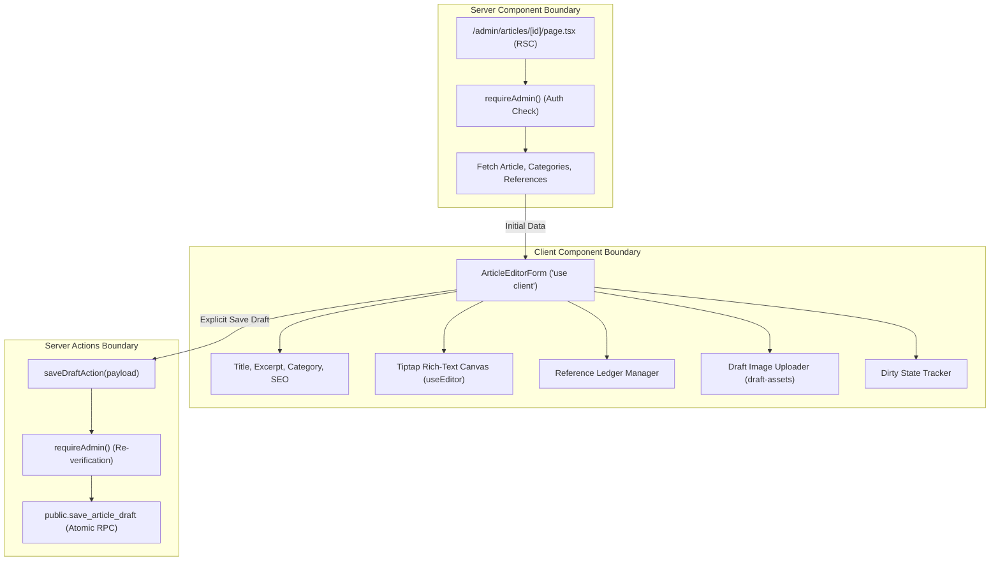

# 29 — Stage 7: Writer Dashboard & Tiptap Editor Design

> **Stage 7 Status:** ACTIVE / DESIGN APPROVED / DESIGN FREEZE  
> **Authority:** AUTHORIZED BY PROJECT OWNER — 2026-08-25  
> **Canonical Base:** `927412a054ccf15bbb1caa23a54a48d761731a04`  
> **Branch:** `stage/07-writer-dashboard-editor`  
> **Application Implementation:** FROZEN PENDING FINAL EXTERNAL REVIEW OF DESIGN HARDENING  
> **Governing Architecture Decision:** D028 (`docs/11-DECISION-LOG.md`)  
> **Subsequent Stage (Stage 8):** NOT AUTHORIZED  

---

## 1. Objective

Deliver the administrative writing and draft-management workspace for Marie Medere under the **Evidence Folio** design system. Stage 7 provides a secure, single-author editorial environment where Marie can compose, edit, save, and reliably reopen article drafts with structured editorial metadata, a custom Tiptap rich-text editor, category assignments, private draft featured image references, structured academic/evidence citations, and search engine optimization fields without risking data loss or public exposure.

---

## 2. In-Scope Routes & Features

1. **`/admin/articles` (Articles List):**
   - Central editorial index listing all articles (drafts, published, archived) with clean status badges and date metadata.
   - Status filtering support via URL query parameter (e.g. `/admin/articles?status=draft`).
   - "New Article" action directing to `/admin/articles/new`.
   - Direct edit access to draft articles (`/admin/articles/[id]`).
   - Read-only representation of published and archived rows (Stage 7 does not permit editing, unpublishing, deleting, or mutating non-draft records).

2. **`/admin/articles/new` (New Draft Composition):**
   - Editorial workspace initializing a clean, unsaved editor state locally.
   - No database article row is inserted merely by loading this route.
   - The first explicit "Save Draft" operation generates a server-side cryptographic UUID, derives an internal provisional slug (`draft-<uuid>`), creates the article and references atomically via RPC, and redirects to `/admin/articles/[id]`.

3. **`/admin/articles/[id]` (Article Draft Editor):**
   - Full Evidence Folio editorial workspace.
   - Document title input with character counter.
   - Tiptap WYSIWYG rich-text editor producing clean ProseMirror JSON.
   - Category selector loading active categories from `public.categories`.
   - Excerpt field for editorial teasers.
   - Private featured image upload and path/alt management backed by the new private `draft-assets` storage bucket.
   - Structured Reference Ledger manager for academic citations.
   - SEO Title and SEO Description inputs.
   - Explicit "Save Draft" action with visual dirty tracking and timestamped confirmation.

---

## 3. Explicit Exclusions (Deferred Scope)

The following capabilities are explicitly deferred to later stages or excluded from V1:

- **Publishing Lifecycle (Stage 8):** `publish`, `unpublish`, `archive`, `delete`, publication status transitions, canonical publication slug generation, publication timestamps (`published_at`), and scheduled publishing.
- **Public Preview & Tokens (Stage 8):** Tokenized preview routes (`/preview/...`), draft preview URLs, or bypasses to public `status = 'published'` query enforcement.
- **Reader Comment Moderation (Stage 9):** Comment approval, rejection, deletion, and public comment submission.
- **Contact Inbox Administration (Stage 9):** Reading, triaging, and responding to contact form submissions.
- **Portfolio Curation UI (Stage 9):** Specialized portfolio project creation and arrangement.
- **Multi-Author / Granular RBAC:** Multiple authors, editorial review workflows, or permission tiers (frozen as single-author per D005).
- **Automated AI Writing / Synthetic Advice:** AI text generation, automated medical summaries, or hallucinated claims (strictly prohibited by `AI_CONTEXT.md`).
- **Reader Analytics / Social Trackers:** Page view counters, tracking pixels, or third-party analytics dashboards.

---

## 4. Current Repository & Schema Audit

### 4.1 Verified Database Schema (VERIFIED FACT)

- **`public.articles` Table:**
  - `id` (uuid, PK, default `gen_random_uuid()`)
  - `title` (text, `NOT NULL`, check `char_length(trim(title)) > 0`)
  - `slug` (text, `NOT NULL`, `UNIQUE`, check `slug ~ '^[a-z0-9]+(?:-[a-z0-9]+)*$'`)
  - `excerpt` (text, nullable)
  - `content_json` (jsonb, `NOT NULL`, default `'{"type": "doc", "content": []}'::jsonb`)
  - `featured_image_path` (text, nullable)
  - `featured_image_alt` (text, nullable)
  - `category_id` (uuid, nullable, FK to `public.categories(id)` on delete restrict)
  - `status` (text, `NOT NULL`, default `'draft'`, check `status in ('draft', 'published', 'archived')`)
  - `is_featured` (boolean, `NOT NULL`, default `false`)
  - `is_portfolio_featured` (boolean, `NOT NULL`, default `false`)
  - `seo_title` (text, nullable)
  - `seo_description` (text, nullable)
  - `published_at` (timestamptz, nullable)
  - `created_at` (timestamptz, `NOT NULL`, default `now()`)
  - `updated_at` (timestamptz, `NOT NULL`, default `now()`)

- **`public.categories` Table:**
  - `id` (uuid, PK, default `gen_random_uuid()`)
  - `name` (text, `NOT NULL`, check `char_length(trim(name)) > 0`)
  - `slug` (text, `NOT NULL`, `UNIQUE`, check `slug ~ '^[a-z0-9]+(?:-[a-z0-9]+)*$'`)
  - `description` (text, nullable)

- **`public.article_references` Table:**
  - `id` (uuid, PK, default `gen_random_uuid()`)
  - `article_id` (uuid, `NOT NULL`, FK to `public.articles(id)` on delete cascade)
  - `title` (text, `NOT NULL`, check `char_length(trim(title)) > 0`)
  - `source_name` (text, `NOT NULL`, check `char_length(trim(source_name)) > 0`)
  - `url` (text, nullable)
  - `citation_details` (text, nullable)
  - `sort_order` (integer, `NOT NULL`, default `0`, check `sort_order >= 0`)

- **Existing Storage Bucket (`public-assets`):**
  - Public bucket (`public = true`), 10MB file limit, for published public assets.

### 4.2 Verified RLS Policies & Security (VERIFIED FACT)

- Authenticated admin (evaluated via `private.is_admin()`) holds full `SELECT`, `INSERT`, `UPDATE`, and `DELETE` on all application tables.
- Anonymous and non-admin callers are strictly limited to `status = 'published'` articles and their associated references.
- Stage-7 introduces a migration during implementation for:
  1. A new private storage bucket: `draft-assets`.
  2. An atomic persistence function: `public.save_article_draft`.

---

## 5. Official Tiptap v3 Research & Package Selection

Inspection of current stable npm metadata confirms Tiptap is on **v3** (`3.30.3`):

- **Next.js App Router Integration Requirements:**
  - The editor must be rendered within a React Client Component (`"use client"`).
  - The hook `useEditor` must be configured with `immediatelyRender: false` to prevent SSR vs. Client hydration mismatch errors in Next.js.
  - Initial content is passed via `content: initialContentJson`.
- **Persistence Model:**
  - Stored format: Pure ProseMirror JSON structure obtained via `editor.getJSON()`.
  - Canonical database target: `public.articles.content_json` (jsonb).
- **Package Selection (Exact Dependencies):**
  - `@tiptap/react@3.30.3`
  - `@tiptap/pm@3.30.3`
  - `@tiptap/starter-kit@3.30.3`
  - `@tiptap/extension-placeholder@3.30.3`
- **Important Configuration Notes:**
  - Do NOT install a separate `@tiptap/extension-link` package. StarterKit v3 includes Link built-in.
  - Tiptap StarterKit v3 includes Underline; explicitly configure `underline: false` because the public renderer does not support underline formatting.
  - Do NOT install `@tiptap/extension-image` (inline body images are not enabled in Stage 7).
  - Do NOT install `TableKit`, `CharacterCount`, `TextAlign`, or collaboration extensions. Character counts for form UX are computed directly from normal field state.

---

## 6. Server / Client Architecture



1. **Server Components:**
   - Execute route authorization via `await requireAdmin()`.
   - Retrieve article draft, category options, and reference records on the server.
   - Pass plain JavaScript data objects as initial props to the client editor.

2. **Client Components:**
   - Manage local form state, validation feedback, and Tiptap editor instance.
   - Provide interactive Reference Ledger manipulation (add, edit, remove, move up/down).
   - Coordinate image file selection and client-to-storage upload to `draft-assets` using the existing authenticated browser client (`src/lib/supabase/client.ts`).
   - Track unsaved changes (`isDirty`) to alert Marie before accidental tab closure.

3. **Server Actions (`src/app/admin/articles/actions.ts`):**
   - Privileged backend mutation handlers (`saveDraftAction`).
   - Every action independently executes `await requireAdmin()`.
   - Validates input and delegates persistence to `public.save_article_draft`.
   - Revalidates admin paths (`/admin/articles`, `/admin/articles/[id]`). Does NOT revalidate public routes (`/blog`, `/portfolio`, `/topics`).

---

## 7. Data Loading Architecture

1. **Articles Index (`/admin/articles`):**
   - Server query using Supabase SSR client:
     ```sql
     SELECT id, title, slug, status, category_id, published_at, updated_at, created_at
     FROM public.articles
     ORDER BY updated_at DESC;
     ```
   - If query parameter `?status=draft` is present, filters rows where `status = 'draft'`.

2. **Draft Detail (`/admin/articles/[id]`):**
   - Concurrent server-side fetches:
     1. Article record by `id`.
     2. Categories from `public.categories` ordered by `name ASC`.
     3. References from `public.article_references` where `article_id = id` ordered by `sort_order ASC`.
   - If article is not found: triggers `notFound()`.
   - If article has `status !== 'draft'`: renders in view-only administrative mode with an informational banner indicating that Stage 7 only edits draft records.

---

## 8. Draft-Slug Strategy (D028 / DG-01: OWNER APPROVED)

- **Owner Decision (D028):** When a draft is first saved, generate a platform cryptographic UUID server-side and derive the provisional slug as:
  ```
  draft-<uuid>
  ```
  *(e.g., `draft-8f3a1b2c-4d5e-4b6a-9a7c-1e2f3a4b5c6d` or `draft-8f3a1b2c4d5e`)*
- **Rationale & Guardrails:**
  1. Guarantees 100% compliance with existing database check constraints (`chk_articles_slug_format`) and uniqueness without requiring database schema migrations or nullable columns.
  2. Prevents title-based slug collisions during drafting.
  3. Clearly demarcates provisional status.
  4. Remains completely hidden from public visitors because public queries enforce `status = 'published'`.
  5. Leaves Stage 8 entirely free to assign Marie's final canonical publication slug upon publishing.

---

## 9. Tiptap JSON Schema & Extensions (D028 / DG-02: OWNER APPROVED)

The Tiptap editor configuration will be:

```typescript
import { useEditor } from "@tiptap/react";
import StarterKit from "@tiptap/starter-kit";
import Placeholder from "@tiptap/extension-placeholder";

const editor = useEditor({
  immediatelyRender: false,
  extensions: [
    StarterKit.configure({
      heading: {
        levels: [2, 3], // Strictly restrict to H2 and H3; H1 is reserved for article title
      },
      underline: false, // Underline disabled (unsupported in public renderer)
      link: {
        openOnClick: false,
        autolink: true,
        HTMLAttributes: {
          class: "text-oxide-link underline underline-offset-2",
          rel: "noopener noreferrer",
        },
      },
      codeBlock: {
        HTMLAttributes: { class: "rounded border border-subtle-divider bg-subtle-field p-4 font-mono text-sm text-ink" },
      },
      blockquote: {
        HTMLAttributes: { class: "border-l-2 border-oxide pl-4 italic text-ink-muted" },
      },
    }),
    Placeholder.configure({
      placeholder: "Write Marie's medical article content here...",
    }),
  ],
  content: initialContentJson,
  onUpdate: ({ editor }) => {
    onContentChange(editor.getJSON());
  },
});
```

---

## 10. Public-Renderer Compatibility Audit

The frozen editor schema is intentionally constrained to nodes and marks supported by the current public renderer. Round-trip fidelity must be verified at the Stage-7 gate.

| Tiptap Editor Node / Mark | Supported in Public Renderer (`article-typography.tsx`) | Status in Editor |
| :--- | :--- | :--- |
| `doc` | YES (`div.article-body`) | Enabled |
| `paragraph` | YES (`p`) | Enabled |
| `heading` (level 2, 3) | YES (`h2`, `h3`) | Enabled (H1 disallowed) |
| `bulletList` / `listItem` | YES (`ul` / `li`) | Enabled |
| `orderedList` / `listItem` | YES (`ol` / `li`) | Enabled |
| `blockquote` | YES (`blockquote`) | Enabled |
| `codeBlock` | YES (`pre > code`) | Enabled |
| `horizontalRule` | YES (`hr`) | Enabled |
| `hardBreak` | YES (`br`) | Enabled |
| `text` | YES (text nodes) | Enabled |
| `bold` mark | YES (`strong`) | Enabled |
| `italic` mark | YES (`em`) | Enabled |
| `strike` mark | YES (`s`) | Enabled |
| `code` mark | YES (`code`) | Enabled |
| `link` mark | YES (`a` with protocol validation) | Enabled (via StarterKit) |
| `underline` mark | NO | **DISABLED** |
| `image` node | NO (Inline images not enabled in Stage 7) | **NOT ENABLED** |
| `table` nodes | NO | **NOT ENABLED** |

---

## 11. Private Draft Media Architecture (D028 / DG-03: OWNER APPROVED)

- **Storage Separation:**
  - `public-assets`: PUBLIC bucket for published articles and public site assets.
  - `draft-assets`: **PRIVATE** bucket introduced in Stage 7 for unpublished draft featured images.
- **`draft-assets` Storage Constraints:**
  - `public = false`
  - Max file size = 5 MB
  - Allowed MIME: `image/jpeg`, `image/png`, `image/webp`, `image/avif`
- **Storage RLS:**
  - `SELECT`, `INSERT`, `UPDATE`, `DELETE` permitted to authenticated admin only (`private.is_admin()`).
  - Anonymous and non-admin access is denied.
  - No public URL access (`getPublicUrl()` is prohibited for `draft-assets`).
  - Draft image preview in admin editor uses authenticated access or short-lived signed URLs.
- **Workflow & Stage-8 Promotion:**
  - `public.articles.featured_image_path` stores the bucket-relative path within `draft-assets` while the article is a draft.
  - Stage 8 owns the promotion/copying of the selected image from `draft-assets` to `public-assets` upon publication.
- **No `public.media` table:** Direct storage path management in `draft-assets` is sufficient for single-author needs.

---

## 12. Featured-Image Authoring Lifecycle

1. **Brand-New Unsaved Article (`/admin/articles/new`):**
   - Featured image upload control is disabled until the first Save Draft succeeds.
   - Displays clear helper text: *"Save the draft once before adding a featured image."*
   - Reason: Avoids orphaned private storage objects with no persistent database record.
2. **Saved Draft (`/admin/articles/[id]`):**
   - Featured image upload is enabled.
   - Upload path: `articles/{articleId}/featured/{timestamp}-{sanitizedFilename}`.
   - Client executes upload directly via authenticated browser client (`src/lib/supabase/client.ts`).
   - Image preview is displayed with input for mandatory `featured_image_alt`.
   - Option to remove or replace the attached image.

---

## 13. Atomic Draft Persistence RPC (D028 / DG-04: OWNER APPROVED)

To guarantee that article updates and structured reference replacements succeed or fail together as a single atomic database transaction, Stage 7 introduces a reviewed PostgreSQL function:

```sql
-- Conceptual signature for public.save_article_draft
create or replace function public.save_article_draft(
  p_article_id uuid,
  p_provisional_slug text,
  p_title text,
  p_excerpt text default null,
  p_content_json jsonb default '{"type": "doc", "content": []}'::jsonb,
  p_category_id uuid default null,
  p_featured_image_path text default null,
  p_featured_image_alt text default null,
  p_seo_title text default null,
  p_seo_description text default null,
  p_references jsonb default '[]'::jsonb
)
returns table (
  article_id uuid,
  slug text,
  updated_at timestamptz
)
language plpgsql
security invoker
set search_path = ''
as $$
-- Transaction logic:
-- 1. Check private.is_admin(). If false, raise exception.
-- 2. If article does not exist:
--      INSERT INTO public.articles (id, slug, title, excerpt, content_json, category_id, featured_image_path, featured_image_alt, seo_title, seo_description, status, published_at, is_featured, is_portfolio_featured)
--      VALUES (p_article_id, p_provisional_slug, p_title, p_excerpt, p_content_json, p_category_id, p_featured_image_path, p_featured_image_alt, p_seo_title, p_seo_description, 'draft', null, false, false);
-- 3. If article exists:
--      Verify status = 'draft'. If not, raise exception 'Cannot mutate non-draft article'.
--      UPDATE public.articles SET title = p_title, excerpt = p_excerpt, content_json = p_content_json, category_id = p_category_id, featured_image_path = p_featured_image_path, featured_image_alt = p_featured_image_alt, seo_title = p_seo_title, seo_description = p_seo_description
--      WHERE id = p_article_id;
-- 4. DELETE FROM public.article_references WHERE article_id = p_article_id;
-- 5. INSERT INTO public.article_references (...) from parsed p_references with sequential sort_order.
-- 6. RETURN QUERY SELECT id, slug, updated_at FROM public.articles WHERE id = p_article_id;
$$;
```

---

## 14. Draft-Save Lifecycle & Dirty Tracking

1. **Initial Clean State:** Form loads initial values from server props. `isDirty` is `false`.
2. **User Edits:** Any keystroke in form fields or Tiptap editor marks `isDirty = true`.
3. **Explicit Save Action:** Marie clicks **"Save Draft"** (or `Ctrl+S` / `Cmd+S`):
   - Button enters `Saving...` state with spinner.
   - Client sends validated payload to `saveDraftAction`.
   - Server Action verifies admin authentication, invokes `public.save_article_draft`.
   - On success: Server returns updated timestamp; UI displays `"Saved at HH:MM:SS"`; `isDirty` resets to `false`.
   - If first save on `/admin/articles/new`: client is redirected to `/admin/articles/[id]`.
   - On error: UI displays inline error banner; form state and editor contents are preserved; `isDirty` remains `true`.
4. **Navigation Guard:** If `isDirty` is true and user attempts browser navigation, triggers native `beforeunload` confirmation.

---

## 15. References Lifecycle (Evidence Folio Reference Ledger)

- **Dedicated Reference Ledger Card:** Rendered below the main editor canvas.
- **Item Fields:**
  - `Title` (Required)
  - `Source / Journal` (Required)
  - `URL` (Optional, validated for `http:`, `https:`)
  - `Citation Details` (Optional)
- **Controls:**
  - **"Add Reference"** button appends an empty reference item.
  - **"Move Up" / "Move Down"** buttons adjust relative positioning without external drag-and-drop dependencies.
  - **"Remove"** button removes the entry from the draft.
- **Persistence:** Persisted atomically via `public.save_article_draft` with deterministic sequential `sort_order` (0, 1, 2...).

---

## 16. Admin Shell Navigation & Layout Refinement

To ensure proper breadcrumb and navigation feedback:
- `/admin` => Header title: `Dashboard`, Active module: `dashboard`
- `/admin/articles` => Header title: `Articles`, Active module: `articles`
- `/admin/articles/new` => Header title: `New Article Draft`, Active module: `articles`
- `/admin/articles/[id]` => Header title: `Edit Article Draft`, Active module: `articles`
- `/admin/articles?status=draft` => Header title: `Draft Articles`, Active module: `drafts`

*Note: No `/admin/drafts` route will be created; drafts filtering is managed cleanly via `/admin/articles?status=draft`.*

---

## 17. Design System Tokens & Utility Alignment

All Stage-7 UI components will strictly adhere to canonical Tailwind tokens defined in `src/app/globals.css`:

- Backgrounds: `bg-paper` (`#FFFDF9`), `bg-parchment` (`#F6F1E8`), `bg-subtle-field` (`#E8E2D7`)
- Text: `text-ink` (`#242321`), `text-ink-muted` (`#5E5953`), `text-oxide-link` (`#7B3F35`)
- Borders: `border-control-border` (`#918579`), `border-subtle-divider` (`#D2C9BC`), `border-oxide` (`#7B3F35`)
- Badges & Accents: `bg-sage` (`#3F5E52`), `ring-focus-slate` (`#265D7A`)

*Invented class names (e.g. `bg-reading-surface`, `border-brand-oxide`, `text-inline-link`) are strictly disallowed.*

---

## 18. Accessibility & Responsive Targets

- **Accessibility Contract:**
  - All form controls feature explicit, associated `<label>` elements.
  - Tiptap editor canvas exposes `role="textbox"` and `aria-label="Article content"`.
  - All toolbar and reference action buttons include `aria-label` attributes, visible focus rings (`focus-visible:ring-2 focus-visible:ring-focus-slate`), and meet the 44px minimum touch target height.
- **Responsive Target:**
  - Required Stage-7 gate target: 0px horizontal overflow across tested Desktop (1440x900), Tablet (1024x768), Mobile (390x844), and Narrow Mobile (320x640) viewports.

---

## 19. Quality & Security Testing Plan

Before closing Stage 7, the following automated tests and verifications must pass:

1. **Authentication & Authorization Gates:**
   - Anonymous request to `/admin/articles` redirects to `/admin/login`.
   - Authenticated non-admin request to `/admin/articles` is denied.
   - Authenticated admin loads articles list and draft editor.
2. **Draft Create / Save / Reopen Lifecycle:**
   - First Save Draft creates row with provisional slug `draft-<uuid>` and redirects to `/admin/articles/[id]`.
   - Populate title, excerpt, Tiptap body, category, featured image, SEO fields, and references.
   - Subsequent Save Draft updates article and references atomically.
   - Reopening `/admin/articles/[id]` verifies 100% data round-trip fidelity.
3. **Atomicity & Rollback Regression Tests (pgTAP):**
   - Successful draft create: article + references persist together.
   - Successful draft update: article + reordered references persist together.
   - Failed reference validation: entire RPC transaction rolls back, preserving pre-save state.
   - Published/archived mutation attempts via RPC: rejected with exception.
   - Non-admin and anonymous RPC calls: denied.
4. **Code Quality Gates:**
   - `npm run typecheck` (0 errors)
   - `npm run lint` (0 errors)
   - `npm run format:check` (PASS)
   - `npm run build` (PASS)
   - `git diff --check` (0 whitespace errors)
   - `npx supabase test db` (All pgTAP tests pass)

---

## 20. Decision Gate Summary (All Owner-Approved)

| Decision Gate | Status | Resolution |
| :--- | :--- | :--- |
| **DG-01: Draft Slug Allocation** | **OWNER APPROVED (D028)** | First Save Draft creates internal provisional slug `draft-<uuid>`. |
| **DG-02: Tiptap Extension Set** | **OWNER APPROVED (D028)** | Exact 4 packages (`react`, `pm`, `starter-kit`, `placeholder`), StarterKit Link used, Underline disabled. |
| **DG-03: Media Management Model** | **OWNER APPROVED (D028)** | Private `draft-assets` bucket for draft images; Stage 8 promotes to `public-assets`. |
| **DG-04: Atomic Draft Persistence** | **OWNER APPROVED (D028)** | `public.save_article_draft` PostgreSQL RPC ensures atomic article + reference persistence. |
