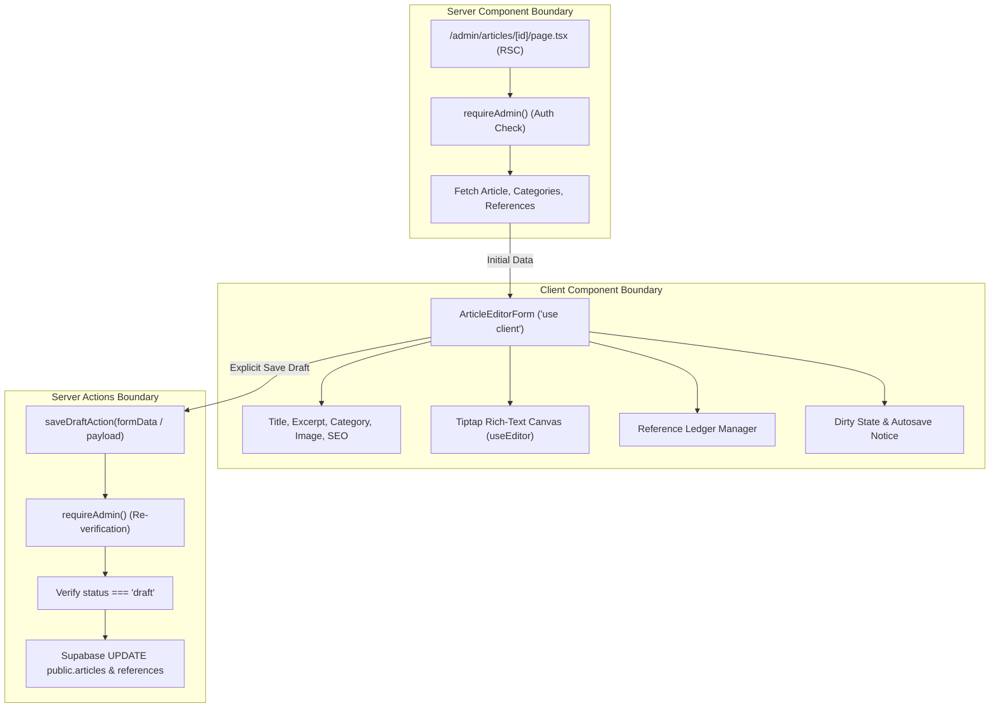

# 29 — Stage 7: Writer Dashboard & Tiptap Editor Design

> **Stage 7 Status:** ACTIVE / PRE-IMPLEMENTATION DESIGN FREEZE  
> **Authority:** AUTHORIZED BY PROJECT OWNER — 2026-08-25  
> **Canonical Base:** `927412a054ccf15bbb1caa23a54a48d761731a04`  
> **Branch:** `stage/07-writer-dashboard-editor`  
> **Application Implementation:** FROZEN PENDING EXTERNAL DESIGN REVIEW  
> **Subsequent Stage (Stage 8):** NOT AUTHORIZED  

---

## 1. Objective

Deliver the administrative writing and draft-management workspace for Marie Medere under the **Evidence Folio** design system. Stage 7 provides a secure, single-author editorial environment where Marie can create, edit, save, and reliably reopen article drafts with structured editorial metadata, a custom Tiptap rich-text editor, category assignments, featured image references, structured academic/evidence citations, and search engine optimization fields without risking data loss or public exposure.

---

## 2. In-Scope Routes & Features

1. **`/admin/articles` (Articles List):**
   - Central editorial index listing all articles (drafts, published, archived) with clean status badges and date metadata.
   - Status filtering support via URL query parameter (e.g. `/admin/articles?status=draft`).
   - "New Article" action directing to `/admin/articles/new`.
   - Direct edit access to draft articles (`/admin/articles/[id]`).
   - Read-only representation of published and archived rows (Stage 7 does not permit editing or mutating non-draft records).

2. **`/admin/articles/new` (New Draft Creation):**
   - Editorial workspace initializing a new article draft record.
   - Immediate allocation of a collision-safe internal provisional draft slug.
   - Redirect to the persistent draft editor route `/admin/articles/[id]`.

3. **`/admin/articles/[id]` (Article Draft Editor):**
   - Full Evidence Folio editorial workspace.
   - Document title input with character counter.
   - Tiptap WYSIWYG rich-text editor producing clean ProseMirror JSON.
   - Category selector loading active categories from `public.categories`.
   - Excerpt field for editorial teasers.
   - Featured image upload and path/alt input backed by `public-assets` Supabase storage.
   - Structured Reference Ledger manager for academic citations.
   - SEO Title and SEO Description inputs.
   - Explicit "Save Draft" action with visual dirty tracking and timestamped confirmation.

---

## 3. Explicit Exclusions (Deferred Scope)

The following capabilities are explicitly deferred to later stages or excluded from V1:

- **Publishing Lifecycle (Stage 8):** `publish`, `unpublish`, `archive`, `delete`, publication status transitions, canonical publication slug generation, publication timestamps (`published_at`), and scheduled publishing.
- **Public Preview & Tokens (Stage 8):** Tokenized preview routes (`/preview/...`), draft preview URLs, or bypasses to public `status = 'published'` query enforcement.
- **Reader Comment Moderation (Stage 9):** Comment approval, rejection, deletion, and public comment submission.
- **Contact Inbox Administration (Stage 9):** Reading, triaging, and responding to contact form submissions.
- **Portfolio Curation UI (Stage 9):** Specialized portfolio project creation and arrangement.
- **Multi-Author / Granular RBAC:** Multiple authors, editorial review workflows, or permission tiers (frozen as single-author per D008).
- **Automated AI Writing / Synthetic Advice:** AI text generation, automated medical summaries, or hallucinated claims (strictly prohibited by `AI_CONTEXT.md`).
- **Reader Analytics / Social Trackers:** Page view counters, tracking pixels, or third-party analytics dashboards.

---

## 4. Current Repository & Schema Audit

### 4.1 Verified Database Schema (VERIFIED FACT)

- **`public.articles` Table:**
  - `id` (uuid, PK, default `gen_random_uuid()`)
  - `title` (text, `NOT NULL`, check `char_length(trim(title)) > 0`)
  - `slug` (text, `NOT NULL`, `UNIQUE`, check `slug ~ '^[a-z0-9]+(?:-[a-z0-9]+)*$'`)
  - `excerpt` (text, nullable)
  - `content_json` (jsonb, `NOT NULL`, default `'{"type": "doc", "content": []}'::jsonb`)
  - `featured_image_path` (text, nullable)
  - `featured_image_alt` (text, nullable)
  - `category_id` (uuid, nullable, FK to `public.categories(id)` on delete restrict)
  - `status` (text, `NOT NULL`, default `'draft'`, check `status in ('draft', 'published', 'archived')`)
  - `is_featured` (boolean, `NOT NULL`, default `false`)
  - `is_portfolio_featured` (boolean, `NOT NULL`, default `false`)
  - `seo_title` (text, nullable)
  - `seo_description` (text, nullable)
  - `published_at` (timestamptz, nullable)
  - `created_at` (timestamptz, `NOT NULL`, default `now()`)
  - `updated_at` (timestamptz, `NOT NULL`, default `now()`)

- **`public.categories` Table:**
  - `id` (uuid, PK, default `gen_random_uuid()`)
  - `name` (text, `NOT NULL`, check `char_length(trim(name)) > 0`)
  - `slug` (text, `NOT NULL`, `UNIQUE`, check `slug ~ '^[a-z0-9]+(?:-[a-z0-9]+)*$'`)
  - `description` (text, nullable)

- **`public.article_references` Table:**
  - `id` (uuid, PK, default `gen_random_uuid()`)
  - `article_id` (uuid, `NOT NULL`, FK to `public.articles(id)` on delete cascade)
  - `title` (text, `NOT NULL`, check `char_length(trim(title)) > 0`)
  - `source_name` (text, `NOT NULL`, check `char_length(trim(source_name)) > 0`)
  - `url` (text, nullable)
  - `citation_details` (text, nullable)
  - `sort_order` (integer, `NOT NULL`, default `0`, check `sort_order >= 0`)

- **Storage Bucket (`storage.buckets` / `storage.objects`):**
  - Bucket name: `public-assets` (public read, 10MB file size limit)
  - Allowed MIME types: `image/jpeg`, `image/png`, `image/webp`, `image/avif`, `application/pdf`

### 4.2 Verified RLS Policies (VERIFIED FACT)

- Authenticated admin (checked via `private.is_admin()`) holds full `SELECT`, `INSERT`, `UPDATE`, and `DELETE` permissions on `public.articles`, `public.categories`, `public.article_references`, and `storage.objects` (`bucket_id = 'public-assets'`).
- Anonymous and non-admin callers are strictly limited to `status = 'published'` articles and their associated references.
- Schema modifications or RLS changes are **NOT** required for Stage 7.

---

## 5. Official Tiptap v3 Research & Audit

An inspection of current stable npm package metadata reveals that the official Tiptap suite is on the **v3 series** (`3.30.3`):

- **Next.js App Router Integration Requirements:**
  - The editor must be rendered within a React Client Component (`"use client"`).
  - The hook `useEditor` must be configured with `immediatelyRender: false` to prevent SSR vs. Client hydration mismatch errors in Next.js.
  - Initial content is passed via `content: initialContentJson`.
- **Persistence Model:**
  - Stored format: Pure ProseMirror JSON structure obtained via `editor.getJSON()`.
  - Canonical database target: `public.articles.content_json` (jsonb).
  - Direct JSON storage guarantees 100% round-trip fidelity between writer input and the Stage-6 public renderer.

---

## 6. Proposed Dependency Set

The following exact packages are identified for Stage 7:

| Package | Version | Purpose | Justification |
| :--- | :--- | :--- | :--- |
| `@tiptap/react` | `3.30.3` | Core React editor bindings & hooks | Essential for React integration (`useEditor`, `EditorContent`) |
| `@tiptap/pm` | `3.30.3` | ProseMirror packages bundled by Tiptap v3 | Required peer dependency for Tiptap v3 core |
| `@tiptap/starter-kit` | `3.30.3` | Baseline editorial extensions bundle | Headings, lists, bold, italic, blockquote, codeblock, etc. |
| `@tiptap/extension-link` | `3.30.3` | Hyperlinks in rich text | Reference linking and external academic citations |
| `@tiptap/extension-placeholder` | `3.30.3` | Visual editor placeholder | Clear UI affordance when the editor canvas is empty |

### Explicitly Excluded / Disallowed Extensions:
- `@tiptap/extension-underline` (Not supported in public renderer; avoid schema mismatch)
- `@tiptap/extension-collaboration` (Single-author project; unnecessary complexity)
- `@tiptap/extension-table` / `TableKit` (Not required for V1 article drafting; deferred)
- AI / Auto-generation plugins (Prohibited under scope freeze and AI guidelines)

---

## 7. Server / Client Architecture



1. **Server Components:**
   - Execute route authorization via `await requireAdmin()`.
   - Retrieve article draft, category options, and reference records on the server.
   - Pass strongly typed, plain JavaScript data objects as initial props to the client editor.

2. **Client Components:**
   - Manage local form state, validation feedback, and Tiptap editor instance.
   - Provide interactive Reference Ledger manipulation (add, edit, remove, reorder).
   - Coordinate image file selection and client-to-storage upload feedback.
   - Track unsaved changes (`isDirty`) to alert Marie before accidental tab closure.

3. **Server Actions (`src/app/admin/articles/actions.ts`):**
   - Privileged backend mutation handlers (`createDraftAction`, `saveDraftAction`).
   - Every action independently executes `await requireAdmin()`.
   - Validates that target records hold `status = 'draft'`.

---

## 8. Data Loading Architecture

1. **Articles Index (`/admin/articles`):**
   - Server query using Supabase SSR client:
     ```sql
     SELECT id, title, slug, status, category_id, published_at, updated_at, created_at
     FROM public.articles
     ORDER BY updated_at DESC;
     ```
   - If query parameter `?status=draft` is present, filters rows where `status = 'draft'`.

2. **Draft Detail (`/admin/articles/[id]`):**
   - Concurrent server-side fetches:
     1. Article record by `id`.
     2. Categories from `public.categories` ordered by `name ASC`.
     3. References from `public.article_references` where `article_id = id` ordered by `sort_order ASC`.
   - If article is not found: triggers `notFound()`.
   - If article has `status !== 'draft'`: renders in view-only administrative mode with an informational banner indicating that Stage 7 only edits draft records.

---

## 9. Mutation Architecture

All draft mutations use Next.js Server Actions with strict input validation:

1. **`createDraftAction()`:**
   - Verifies admin authentication.
   - Generates provisional title (default: `"Untitled Draft"`) and unique draft slug (`draft-<short-uuid>`).
   - Inserts record into `public.articles` with `status = 'draft'`, `published_at = null`.
   - Redirects to `/admin/articles/[id]`.

2. **`saveDraftAction(payload)`:**
   - Verifies admin authentication.
   - Validates target article exists and `status === 'draft'`.
   - Updates fields in `public.articles`: `title`, `excerpt`, `content_json`, `category_id`, `featured_image_path`, `featured_image_alt`, `seo_title`, `seo_description`.
   - Replaces `public.article_references` in an atomic sequence (deleting prior references for the article and inserting updated references with sequential `sort_order` indices).
   - Revalidates admin and public article paths.
   - Returns `{ success: true, updated_at: string }` or structured validation errors.

---

## 10. Draft-Slug Strategy (DECISION GATE)

> [!IMPORTANT]
> **DECISION GATE: Draft Slug Allocation**  
> **Status:** PROPOSED DIRECTION FOR EXTERNAL REVIEW  
> **Constraint:** `public.articles.slug` is `NOT NULL`, `UNIQUE`, and must match regex `^[a-z0-9]+(?:-[a-z0-9]+)*$`. Stage 8 owns canonical public publishing slug rules.

### Recommended Approach: Internal Provisional Draft Slug
- When an article draft is created, allocate an internal provisional slug formatted as:
  ```
  draft-<12-character-nanoid-or-uuid-prefix>
  ```
  *(e.g., `draft-8f3a1b2c4d5e`)*
- **Rationale:**
  1. Guarantees 100% compliance with existing database check constraints and uniqueness without requiring database schema migrations or nullable columns.
  2. Prevents title-based slug collisions during drafting.
  3. Clearly demarcates provisional status.
  4. Remains invisible to public visitors because public queries enforce `status = 'published'`.
  5. Leaves Stage 8 entirely free to compute and assign Marie's final publication slug.

---

## 11. Tiptap JSON Schema & Extensions

The Tiptap editor configuration will be configured as follows:

```typescript
import { useEditor } from "@tiptap/react";
import StarterKit from "@tiptap/starter-kit";
import Link from "@tiptap/extension-link";
import Placeholder from "@tiptap/extension-placeholder";

const editor = useEditor({
  immediatelyRender: false,
  extensions: [
    StarterKit.configure({
      heading: {
        levels: [2, 3], // Strictly restrict to H2 and H3; H1 is reserved for article title
      },
      codeBlock: {
        HTMLAttributes: { class: "rounded border bg-subtle-field p-4 font-mono text-sm" },
      },
      blockquote: {
        HTMLAttributes: { class: "border-l-2 border-brand-oxide pl-4 italic" },
      },
    }),
    Link.configure({
      openOnClick: false,
      autolink: true,
      HTMLAttributes: {
        class: "text-inline-link underline underline-offset-2",
        rel: "noopener noreferrer",
      },
    }),
    Placeholder.configure({
      placeholder: "Write Marie's medical article content here...",
    }),
  ],
  content: initialContentJson,
  onUpdate: ({ editor }) => {
    onContentChange(editor.getJSON());
  },
});
```

---

## 12. Public-Renderer Compatibility Audit

| Tiptap Editor Node / Mark | Supported in Public Renderer (`article-typography.tsx`) | Handling Strategy |
| :--- | :--- | :--- |
| `doc` | YES (`div.article-body`) | Direct 1:1 render |
| `paragraph` | YES (`p`) | Direct 1:1 render |
| `heading` (level 2, 3) | YES (`h2`, `h3`) | Direct 1:1 render (H1 disallowed in editor) |
| `bulletList` / `listItem` | YES (`ul` / `li`) | Direct 1:1 render |
| `orderedList` / `listItem` | YES (`ol` / `li`) | Direct 1:1 render |
| `blockquote` | YES (`blockquote`) | Direct 1:1 render |
| `codeBlock` | YES (`pre > code`) | Direct 1:1 render |
| `horizontalRule` | YES (`hr`) | Direct 1:1 render |
| `hardBreak` | YES (`br`) | Direct 1:1 render |
| `bold` mark | YES (`strong`) | Direct 1:1 render |
| `italic` mark | YES (`em`) | Direct 1:1 render |
| `strike` mark | YES (`s`) | Direct 1:1 render |
| `code` mark | YES (`code`) | Direct 1:1 render |
| `link` mark | YES (`a` with protocol validation) | Direct 1:1 render |

**Compatibility Verdict:** 100% schema alignment. The editor schema produces only nodes and marks that are fully rendered by the Stage-6 public typography system.

---

## 13. Article Form Model

The form payload submitted on Save Draft comprises:

```typescript
interface ArticleDraftFormData {
  id: string; // Target article UUID
  title: string; // Article title (max 200 chars)
  excerpt: string | null; // Teaser excerpt (max 500 chars)
  categoryId: string | null; // Selected category UUID
  contentJson: Record<string, unknown>; // Tiptap ProseMirror document
  featuredImagePath: string | null; // Storage path in public-assets
  featuredImageAlt: string | null; // Mandatory if featuredImagePath is set
  seoTitle: string | null; // Custom SEO title override
  seoDescription: string | null; // Custom meta description
  references: Array<{
    id?: string;
    title: string;
    sourceName: string;
    url?: string | null;
    citationDetails?: string | null;
    sortOrder: number;
  }>;
}
```

---

## 14. Draft-Save Lifecycle & Dirty Tracking

1. **Initial Clean State:** Form loads initial values from server props. `isDirty` is `false`.
2. **User Edits:** Any keystroke in form fields or Tiptap editor marks `isDirty = true`.
3. **Save Action:** Marie clicks **"Save Draft"** (or presses `Ctrl+S` / `Cmd+S` shortcut):
   - Button enters `Saving...` disabled state with spinner.
   - Client sends full validated payload to `saveDraftAction`.
   - On success: Server returns updated timestamp; UI displays `"Saved at HH:MM:SS"`; `isDirty` resets to `false`.
   - On validation/network error: UI displays inline error banner with field-level highlights; `isDirty` remains `true`.
4. **Navigation Guard:** If `isDirty` is true and user attempts browser navigation, triggers native `beforeunload` warning.

---

## 15. References Lifecycle (Evidence Folio Reference Ledger)

- **Dedicated Reference Ledger Card:** Rendered below the main editor canvas.
- **Item Fields:**
  - `Title` (Required, e.g. *"Primary Prevention of Cardiovascular Disease"*)
  - `Source / Journal` (Required, e.g. *"New England Journal of Medicine"*)
  - `URL` (Optional, validated for `http:`, `https:`)
  - `Citation Details` (Optional, e.g. *"2024; 390:1234-1245. DOI: 10.1056/NEJM..."*)
- **Controls:**
  - **"Add Reference"** button appends an empty reference item.
  - **"Move Up" / "Move Down"** buttons adjust relative positioning without external drag-and-drop dependencies.
  - **"Remove"** button removes the entry from the draft.
- **Persistence:** Saved atomically with the article draft into `public.article_references`.

---

## 16. Media & Image Insertion Lifecycle

- **Storage Target:** Supabase Storage bucket `public-assets`.
- **Upload Path:** `articles/{articleId}/{timestamp}-{sanitizedFilename}`.
- **Validation:**
  - Accepted MIME types: `image/jpeg`, `image/png`, `image/webp`, `image/avif`.
  - Max file size: 5 MB.
- **Alt Text Requirement:** Mandatory `featured_image_alt` text field when a featured image is attached.
- **Storage Direct vs. Upload Action:** Uploads execute via Supabase SSR authenticated client on the server or authenticated client SDK.

---

## 17. Validation Contract

| Field | Rule | Error Message |
| :--- | :--- | :--- |
| `title` | Non-empty after trim, max 200 chars | *"Article title is required."* |
| `content_json` | Must be a valid ProseMirror doc object | *"Invalid article content format."* |
| `category_id` | Must be a valid UUID or null | *"Please select a valid category."* |
| `featured_image_alt` | Required if `featured_image_path` is present | *"Alternative text is required when a featured image is set."* |
| `reference.title` | Required for each reference row | *"Reference title cannot be blank."* |
| `reference.source_name` | Required for each reference row | *"Reference source name cannot be blank."* |
| `reference.url` | Must be valid HTTP/HTTPS URL if present | *"Reference URL must begin with http:// or https://"* |

---

## 18. Error States & User Feedback

1. **Authentication Failure:** Server Action / RSC immediately redirects to `/admin/login`.
2. **Draft Not Found:** Displays restrained Evidence Folio empty state with link back to `/admin/articles`.
3. **Immutable Record Protection:** If a user navigates to `/admin/articles/[id]` for a published or archived article, the editor renders in **View-Only Mode** with a notice: *"This article is published. Content editing is locked in Stage 7."*
4. **Network / Database Error:** Non-destructive toast/banner reporting the error while retaining all client form content and Tiptap state in memory so no writing is lost.

---

## 19. Accessibility Contract (a11y)

- All inputs feature persistent, associated `<label>` elements.
- Tiptap editor canvas exposes `role="textbox"` and `aria-label="Article content"`.
- Toolbar buttons include descriptive `aria-label` attributes and visible focus rings (`ring-2 ring-[#265D7A]`).
- Minimum touch target height of 44px on all interactive buttons and inputs.
- High-contrast text tokens (`#242321` ink on `#FFFDF9` paper and `#F6F1E8` canvas).

---

## 20. Responsive Admin Behavior

- **Desktop (1440px):** Two-column editorial layout (main canvas 720px measure; metadata sidebar for category, SEO, and featured image).
- **Tablet (1024px) & Mobile (390px / 320px):** Single-column stacked layout with collapsible metadata sections.
- Verified 0px horizontal overflow across all viewports.

---

## 21. Security & RLS Enforcement

- Every public route continues to enforce `status = 'published'`. Drafts created in Stage 7 remain strictly inaccessible to anonymous visitors.
- Every Server Action independently checks `private.is_admin()` using the authenticated request context.
- Zero service-role credentials are used or exposed in client bundles.

---

## 22. Quality & Security Testing Plan

Before closing Stage 7, the following automated and manual tests must pass:

1. **Authentication & Authorization Gates:**
   - Anonymous request to `/admin/articles` redirects to `/admin/login`.
   - Authenticated non-admin request to `/admin/articles` is denied.
   - Authenticated admin loads articles list and draft editor.
2. **Draft Create / Save / Reopen Lifecycle:**
   - Create new draft -> allocated unique provisional slug -> redirected to editor.
   - Populate title, excerpt, Tiptap body, category, featured image, SEO fields, and 3 references.
   - Click Save Draft -> verified saved to database.
   - Reload page (`/admin/articles/[id]`) -> verify 100% data round-trip fidelity.
3. **Mutation Boundary Tests:**
   - Attempting to mutate a published or archived article via Stage-7 actions returns an explicit rejection error.
4. **Code Quality Gates:**
   - `npm run typecheck` (0 errors)
   - `npm run lint` (0 errors)
   - `npm run format:check` (PASS)
   - `npm run build` (PASS)
   - `git diff --check` (0 whitespace errors)
   - `npx supabase test db` (All database pgTAP tests pass)

---

## 23. Stage-7 Gate Criteria

The Stage-7 gate will pass when:
1. Marie can create a new article draft, write rich text with headings, lists, quotes, and links in Tiptap, assign metadata and references, and save the draft.
2. Reopening the draft completely restores all text, marks, references, and metadata.
3. Draft content remains strictly hidden from public pages and public search.
4. All quality gates, linting, build, and responsive checks pass with zero errors.

---

## 24. Stage-8 Handoff Boundary

Upon Stage-7 gate approval, Stage 8 will take ownership of:
- Assigning canonical publishing slugs (`slug`).
- Setting `status = 'published'`, `published_at = now()`.
- Updating live published content.
- Unpublishing, archiving, and deleting articles.
- Tokenized public preview workflows.

---

## 25. Unresolved Decision Gates

| Decision Gate | Options | Proposed Recommendation | Status |
| :--- | :--- | :--- | :--- |
| **DG-01: Draft Slug Allocation** | A) Nullable slug column<br>B) Provisional slug (`draft-<short-uuid>`) | **Option B:** Provisional unique kebab-case slug satisfies existing schema constraint without migration. | **PENDING REVIEW** |
| **DG-02: Tiptap Extension Set** | A) Minimal 5-package set<br>B) Include TableKit & Underline | **Option A:** Minimal set matching public renderer with 0 schema mismatch. | **PENDING REVIEW** |
| **DG-03: Media Management Model** | A) Direct storage upload paths<br>B) Add `public.media` database table | **Option A:** Direct storage paths in `public-assets` satisfy V1 single-author needs without schema changes. | **PENDING REVIEW** |
